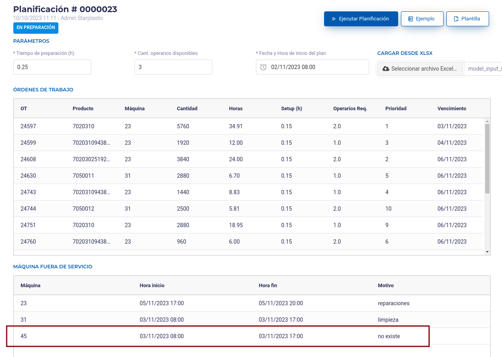
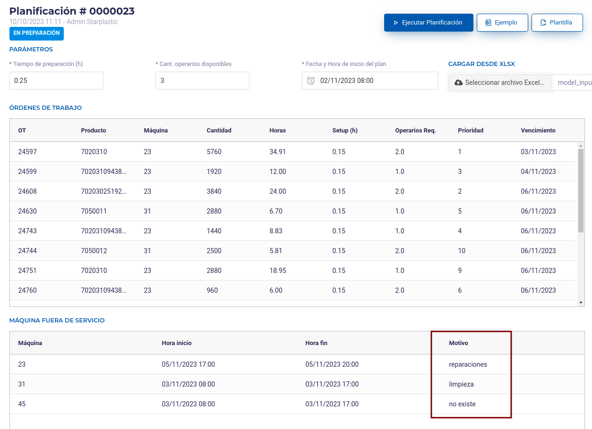
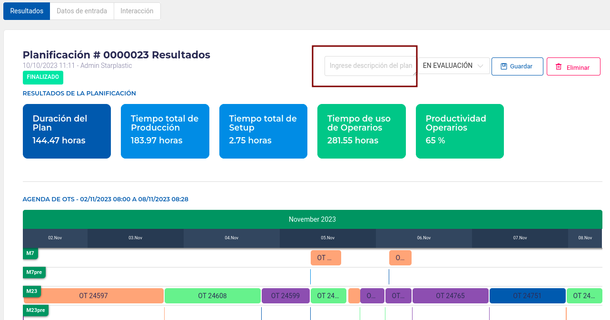
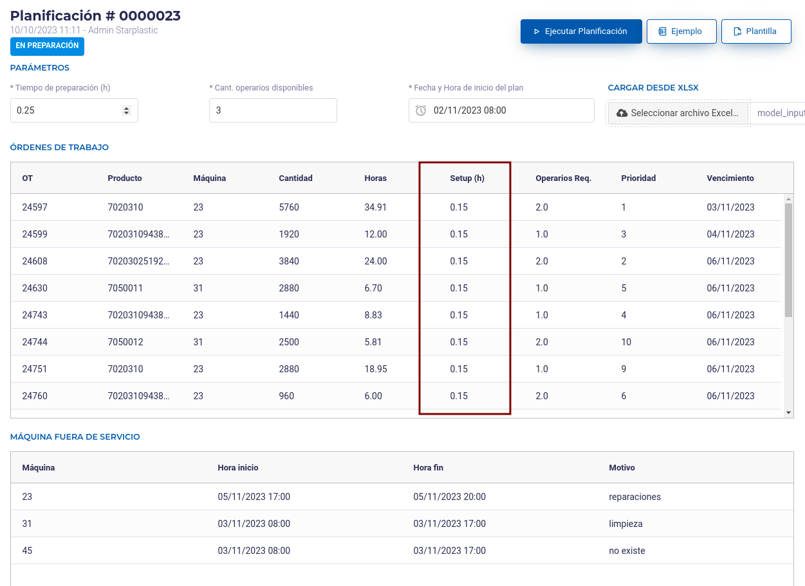
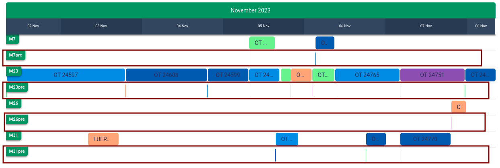

# APP Starplastic - Últimos cambios

Plataforma para sensorización y planificación industrial.

## Actualización 17/10/2023 - v0.4.6

### #1 Planificador - Planificador versión 4

Se implementó la versión 4 del planificador, con mejoras en algunos casos donde daba resultado infactible.

### #2 Planificador - Zoom IN OUT en GANTT

Se incorporó una barra de tipo SLIDER para poder hacer zoom en una región específica del diagrama de gantt de resultados del planificador.

### #3 Planificador - Cambio de nombre en excel de input

En el archivo excel de input, en la hoja **config**, se cambió el parámetro **tiempo_setup** por **tiempo_preparacion**.

### #4 Planificador - Mensajes emergentes en OT cuando se presiona en el Gantt

Se compactó la información para poder mostrar más información. Los mensajes no desaparecen, se mantienen hasta que el usuario la cierre.

### #5 Planificador - Visualización agenda OT en resultados

Se agregó más información en la tabla de resultados de la planificación, incorporando el producto, la cantidad, las horas estimadas y el personal estimado.

## Actualización 10/10/2023 - v0.4.5

### #1 Planificador - Relajar restricción en máquinas fuera de servicio

Permitir agregar máquinas fuera de servicio que no tengan que ver con las OT en curso

Y la Planificación se ejecuta normalmente y la ignora.

### #2 Planificador - Agregar comentario en máquinas fuera de servicio

Permitir agregar una observación en máquinas fuera de servicio. Se agrega en el campo **Motivo**

Esta información se visualiza posteriormente tanto en los datos de entrada como el diagrama de gantt.

### #3 Planificador - Permitir agregar observaciones a una planificación y mostrar en listado

Una vez que la planificación, se realizó, permitir asociar un comentario a la planificación.

Dicho comentario se visualiza en la vista de listado de planificaciones.

### #4 Planificador - Agregar tiempo de preparación para cada OT

En el listado de OT, agregar campo **Setup (h)** que se refiere al tiempo de preparación para cada máquina antes de fabricar la OT

Dicho tiempo se visualiza posteriormente en el diagrama de gantt, con el número de la máquina más el sufijo **pre**

### #5 Planificador - Modificación de formato de importación de datos Excel

* Hoja **OT**: Se agregó al final la columna **setup_maquina**
* Hoja **fuera_servicio**: Se agregó al final la columna **motivo**

