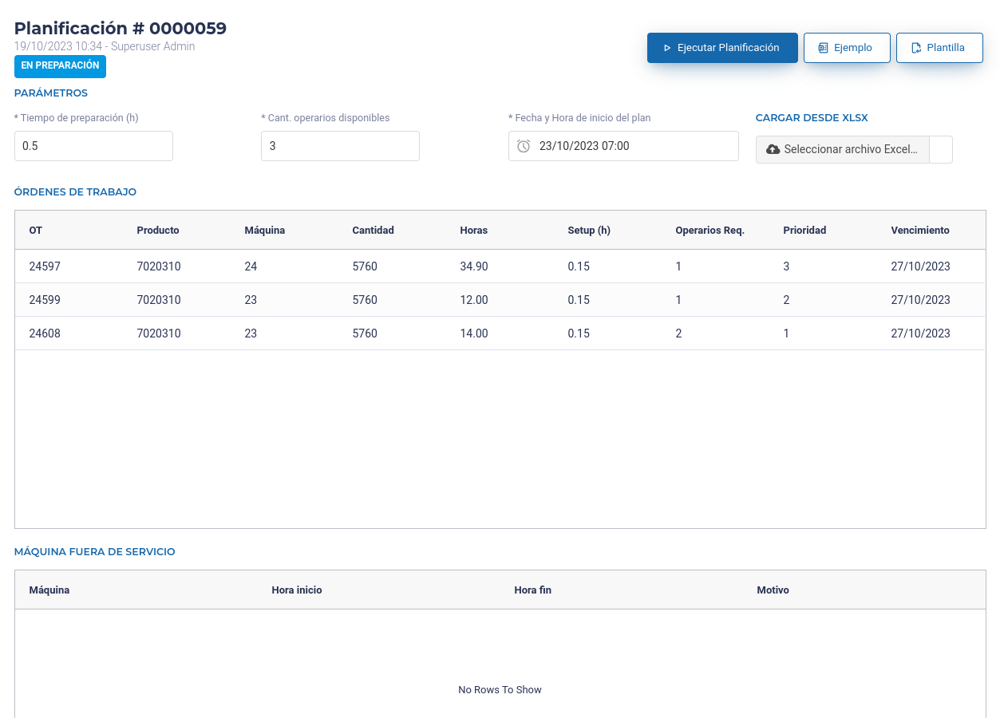
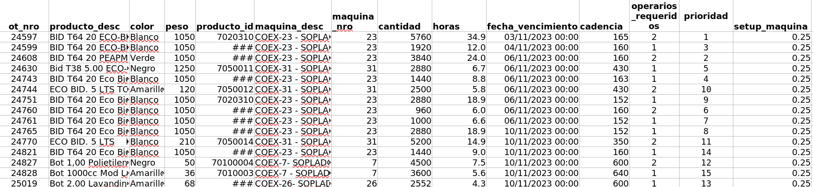
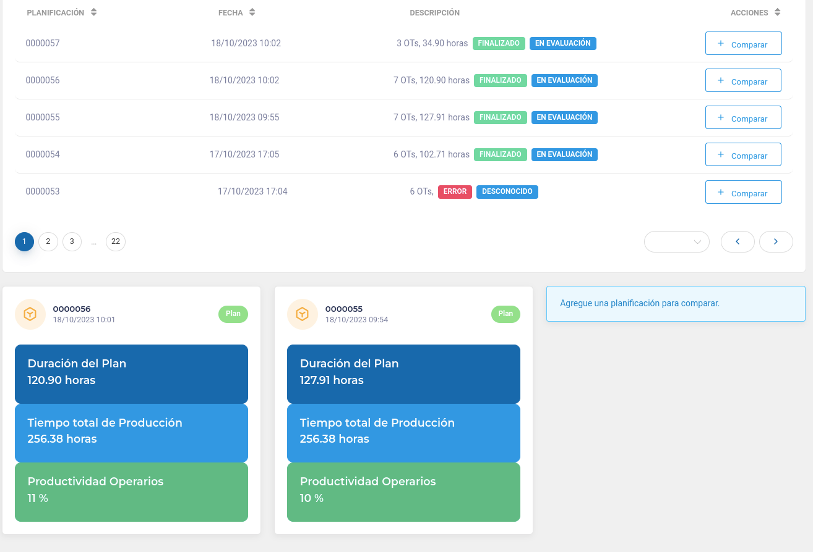

# APP Starplastic - Manual del usuario

Plataforma para sensorización y planificación industrial para Starplastic.

## Acceso General a la aplicación

Para ingresar a la aplicación, el usuario debe acceder al sitio:
https://ingarue.santafe-conicet.gov.ar/admin/

Allí, deberá ingresar con usuario y contraseña.
Inicialmente, se crearon 2 usuarios con sus respectivos niveles de Administrador y Operario:
* Administrador - Usuario: **admin.sp@app0.me** - Contraseña: **starpla2023DASH.**
* Operario - Usuario: **operario.sp@app0.me** - Contraseña: **starpla2023DASH.**
(Contraseñas sin comillas, con punto final).

Una vez colocado el usuario y la contraseña, se accede a la pantalla inicial (HOME).
La Página Inicial tiene las siguientes secciones:

* Menú lateral con opciones
* Encabezado con datos generales del sistema
* Dashboard de Estado actual de las máquinas con sensores activos

La aplicación se divide en dos grandes funcionalidas, sensorización en tiempo real y planificación de la producción, que serán descriptas a continuación.

## Sensorización en tiempo real de las máquinas

Esta funcionalidad se enmarca dentro de lo que se llama **Internet of things** y forma parte de lo que se suele llamar **industria 4.0**.

Se utiliza una arquitectura conocida como MQTT.

En esta arquitectura, las máquinas emiten información en tiempo real mediante un dispositivo asociado y un servicio de la aplicación lee y procesa esta información mediante el acceso a un servicio cloud gratuito.

* Servidor MQTT: **broker.hivemq.com**
* Puerto Servidor MQTT: **1883**

El servicio se suscribe a ciertas cadenas de mensajes con un formato en particular.

Se espera que los mensajes tengan el formato **Máquina/MXX/METRICA/VALOR_ESTADO** donde **VALOR_ESTADO** puede tomar estos valores:
* CambioDeMolde
* EnPreparación
* EnProducción
* EnLimpiezaLubricación
* EnPreventivo
* EnCorrectivo

Por el momento, **METRICA** solo utiliza el valor **estado**, pero más adelante podrá tomar más valores relacionados a la máquina.

En el sistema, se configura a que máquinas se debe suscribir el proceso.

La información obtenida para el sistema, por un lado se almacena como vino y por otro lado se procesa para obtener valores procesados y/o sumarizados que puedan mostrarse en forma más eficiente.

## Planificación de a Producción con Modelado Matemático

Esta funcionalidad utiliza modelado matemático para la planificación de la producción de la fábrica.

El modelado matemático se realiza utilizando OR-Tools (Operations Research Tools) y es una poderosa técnica que se utiliza para abordar y resolver problemas complejos de optimización en una amplia gama de aplicaciones, en este caso para la programación de horarios y la asignación de recursos. OR-Tools proporciona un conjunto de bibliotecas y solucionadores que permiten a los analistas y científicos de datos formular problemas en términos matemáticos y encontrar soluciones óptimas o aproximadas mediante algoritmos eficientes.

## Menú y Opciones

* Estado actual: Estado Actual de las máquinas provistas por los sensores
* Planificación: Planificación de la producción
* KPIs: Acceso a los indicadores de las máquinas.
* Máquinas: Detalle de máquinas.
* Productos: Detalle de productos.

## Home / Estado Actual de las máquinas

En esta sección se visualizan los estados de las máquinas. Solamente se visualizarán aquellas máquinas que estén configuradas como **máquinas con sensor de estado**.

Por cada máquina, se observa:
* Nombre / Número de la máquina
* Último estado con su correspondiente fecha
* Un color asociado al estado, para diferenciarlas fácilmente.
* Un ícono indicativo
* Botón para acceder a **Más detalles** de esa máquina

### Detalle de máquina - Gráficos

En esta sección, para una máquina en particular, se visualiza la información provista por los sensores, y se establece un porcentaje correspondiente a cada estado.

Visualización histórica del estado de la máquina:
* Estadísticas por día: Gráfico de utilización de la máquina
* Estadísticas por día: Tabla con tiempo y estado de la máquina
* Estadísticas por día: Histograma de estados de la máquina por día
* Estadísticas por hora: Histograma de estados de la máquina por hora para un día

### Detalle de máquina - Datos

En esta sección, para una máquina en particular, se visualiza en forma de tabla la información provista por los sensores tanto en forma procesada como la información recibida en forma directa por los sensores, tanto por día como para un día en particular.

Se provee la descarga en formato **csv** de lo enviado por el sensor para una máquina en un día en particular

## Planificador

En esta sección se encuentra toda la funcionalidad relacionada al planificador.

### Listado de planificaciones ejecutadas

Aquí, se presenta y observa el listado de todas las planificaciones que se han generado previamente, incluso las que resultaron en un error.

A cada ejecución se le asigna un número y es guardada con una fecha de generación y un estado hasta que el usuario decida eliminarla.

También se muestra una descripción de la cantidad de órdenes de trabajo, una descripción ingresada por el usuario y la duración estimada.

Se visualizan dos estados. Por un lado, el estado de la ejecución, donde se muestra si la planificación pudo realizarse o ocurrió algún error. Por otro lado, posteriormente, se encuentra el estado que indicará si el plan se ejecutó o no en la planta.

Al hacer click sobre alguna planificación de esta lista, se accederá al detalle de la planificación.

También se encuentran los botones para acceder a **Nueva Planificación** y **Comparar Planificaciones**.

### Nueva planificación

Inicialmente se visualizan datos de ejemplo para ejecutar una nueva planificación.

Información:
* El número de ID asignado por el sistema a la nueva planificación a realizar (59 en el ejemplo)
* fecha y hora actual estado “en preparación”, por defecto, referido al plan que se puede generar mediante esta pantalla.

Parámetros: 
* Tiempos de preparación (h). Es el tiempo de preparación requerido para iniciar una orden de trabajo, dado en horas. 
* Cant. operarios disponibles: Es la cantidad de personal que estará disponible para producción en los equipos involucrados en el plan.
* Fecha y hora de inicio del plan: Por defecto, se carga la fecha del día de mañana al momento de la visualización, a las 7 a.m. Los tres parámetros previos son modificables, más adelante se especifica más sobre ello.

Órdenes de trabajo (Datos de las OTs a planificar):
* OT: Número de OT (único)
* Producto: Código de producto
* Máquina: Número de máquina
* Cantidad: Cantidad a fabricar
* Horas: Horas estimadas para la fabricación
* Setup: Tiempo de preparación para ese producto en esa máquina
* Operarios Req: Operarios requeridos para manipular la máquina
* Prioridad
* Vencimiento: Fecha máxima de entrega de productos

Máquinas fuera de servicio (Detalle de las máquinas fuera de servicio durante el período estimado el plan):
* Máquina: Número de máquina
* Hora de inicio: Hora de inicio fuera de servicio
* Hora de fin: Hora de fin fuera de servicio
* Motivo

Se visualizan tres botones y un campo de archivo:
* Ejecutar planificación: Realizar la ejecución del plan
* Ejemplo: Descargar un archivo excel con datos de ejemplo para información del usuario
* Plantilla: Descarga de archivo excel vacía para ser completada por el usuario
* Cargar datos desde XLSX: Carga de información desde un archivo de excel provisto por el usuario.

Existen distintas opciones para el usuario, con el objeto de configurar los datos requeridos para generar un nuevo plan de producción.

#### Configurar datos desde archivo excel

El usuario puede descargar un archivo Excel con un ejemplo de datos de entrada haciendo click en el botón Ejemplo o bien, descargar un archivo Excel con la plantilla para introducir los datos de la nueva planificación, en el botón Plantilla. Esta plantilla debe respetarse a la hora de cargar los datos de entrada a la App.

Para cargar la plantilla las OTs que requieren de ser agendadas, se deberán completar los siguientes datos en la Hoja OT:

Se presenta un ejemplo:

Importante: La versión actual del sistema permite agendar OTs en hasta un aproximado a 5 máquinas (orientado al área de envases reciclados). Colocando cantidades mayores de equipos, así como una gran cantidad OTs, el sistema ejecuta, pero puede entregar soluciones de baja calidad. 

Luego, en la Hoja Config de esta planilla también se deberá indicar: 
* Tiempo de preparación (preparación) – en horas
* Cantidad de operarios disponibles – cantidad de personas
* Fecha de inicio del plan – fecha y hora a partir de la cual se quiere iniciar la agenda de OTs planificadas.

Por otra parte, en la Hoja Fuera_servicio, se debe indicar: 
* Máquinas que tengan planificado un tiempo de indisponibilidad, con su tiempo de inicio y fin de no disponibilidad (incluye no disponibilidad a futuro y no disponibilidad al inicio del horizonte de planificación, puede ser por una parada de equipo planificada o bien, porque la máquina está terminando de ejecutar una OT del plan anterior) – en nro. de máquina, fecha y hora de inicio, y fecha y hora de fin.

Botón Cargar desde XLSX:

Sea que el usuario utilizó la plantilla para insertar nuevos datos, o bien el Ejemplo como base y modificó allí los datos, ese archivo .xlsx es el que tendrá los datos necesarios para ejecutar una nueva planificación. Este proceso se inicia a partir de la carga de dicho archivo desde el botón Cargar Desde xlsx.

Una vez seleccionado el archivo .xlsx con los datos en su formato correcto, estos se visualizarán (se actualizarán) en la pantalla de la App.

Existe la posibilidad de modificar los datos allí mismo en la interfaz de usuario, si el usuario lo necesitara. 

#### Configurar datos desde otra planificación

Existe la posibilidad de generar una planificación basandose en una planificación realizada previamente.

Para realizar esto, el usuario debe ir a la planificación que se quiere utilizar como origen.

En esa planificación, en la pestaña **Datos de entrada**, debe presionar el botón **Copiar Planificación**

#### Configurar datos con los datos de ejemplo

El usuario puede modificar los datos de entrada para una nueva planificación, a partir de los datos que aparecen por defecto.

Se entiende que este modo solo puede ser útil para realizar una demostración para un nuevo usuario.

### Ejecución de planificación

Una vez lanzada la ejecución de la planificación, la App mostrará una pantalla, informando que se está en proceso de generación del plan. La generación del plan, dependiendo de los datos considerados, puede ser inmediata o tardar hasta 10 minutos.

Se mostrará información emergente acerca del estado de la ejecución.

Una vez terminada la ejecución del modelo, se emitirá el mensaje correspondiente al usuario (**Planificación XXX FINALIZADA finalizada**) y la solución generada se guarda con un identificador y aparecerá en la lista de planificaciones.

Si la ejecución no fue exitosa, se muestra un mensaje de error al respecto.

Si la ejecución fue exitosa, para visualizar el resultado, se debe hacer click en botón **Actualizar** y se visualizarán los detalles de la planificación.

### Resultado de la planificación FINALIZADA

Si la planificación genera una agenda, la misma se presenta con un diagrama de Gantt y se muestran sus indicadores más relevantes vinculados a dicho plan.

Además, en la misma pantalla, se muestra una tabla con los datos del plan desplegado en el Gantt,  más la consideración de operarios por cada OT.

Existe un espacio para darle un descripción al plan, que se muestra en el listado y para definirle un Estado al plan, entre En Evaluación, Descartado o Planificado. El objeto de esto es que se puedan diferenciar los planes que son generados para evaluar, probar, comparar, de los planes que efectivamente se bajan a piso de planta. 

Allí mismo, se ubican los botones para guardar o eliminar el plan.

### Resultado de la planificación ERROR

Si la ejecución resulta en un error, se emitirá un mensaje orientativo para al usuario, a fin de corregir algún dato que pueda estar interfiriendo con la obtención de una agenda factible. Existen distintos tipos de mensajes, de acuerdo al tipo de error. 

Ante esta situación, el usuario puede probar modificando los datos sugeridos por el mensaje y volver ejecutar la planificación (como se describió en Opción 2). Si la ejecución volviera a dar error, pero el mensaje de salida cambiara, el usuario debería repetir el procedimiento. Por el contrario, si el mensaje de salida fuera el mismo, y la sugerencia de corrección ya ha sido contemplada, el usuario debería contactarse al mail matiasnovas@gmail.com, enviando el set de datos que da error o indicando el ID de la planificación que se requiere estudiar.

En este caso, la salida se guarda igualmente en la lista de planificaciones, con una identificación de estado “error” en color rojo.

Si se requiere eliminar el plan con estado “error” de la lista de planificaciones, se debe hacer click en el plan, y luego ir a Eliminar. Se recomienda que el primer periodo de prueba de la APP no se borren las planificaciones con error por si requieren una revisión posterior o ajuste.

### Comparar planificaciones

A partir de la pantalla principal de Planificación, además de entrar a cada plan previo o ejecutar un nuevo plan, se pueden comparar planes guardados. Esto, entre otras cosas, permite que, al generar escenarios distintos para un mismo caso, los mismos se puedan comparar rápidamente.

Para ello, hay que hacer click en botón Comparar Planificaciones, lo cual habilita el botón Comparar para cada una de las planificaciones guardadas.

Al ir haciendo click en cada una de las seleccionadas para comparar, las mismas aparecen debajo de la lista, caracterizadas por tres indicadores cada una. Se pueden comparar de a tres planes por vez. Los indicadores son: duración del plan, tiempo total de producción, y productividad de operarios.

## KPIs

En esta sección, veremos indicadores relacionados a la utilización de todas las máquinas para un mes en particular en un diagrama.

Se debe seleccionar mes y año y se debe presionar el botón **Aplicar**. 

Se visualiza un gráfico con porcentaje de utilización de la máquina, cuando se recibió el último estado de la máquina y cuantos estados se recibieron en el mes de esa máquina.

También se puede acceder a una visualización donde observaremos la cantidad de estados recibidos en el último día, últimos 7 días y últimos 15 días, pudiendo comparar el comportamiento de los sensores de las máquinas.

## Máquinas

Listado de máquinas configuradas en el sistema.

En color naranja se visualizan las que no disponen de sensor y en color azul las que disponen sensor.

Accediendo al detalle, podremos ver la información de la misma.

Aquí podremos setear si la máquina tiene sensor o no.

También se podrá setear un estado en forma manual.

